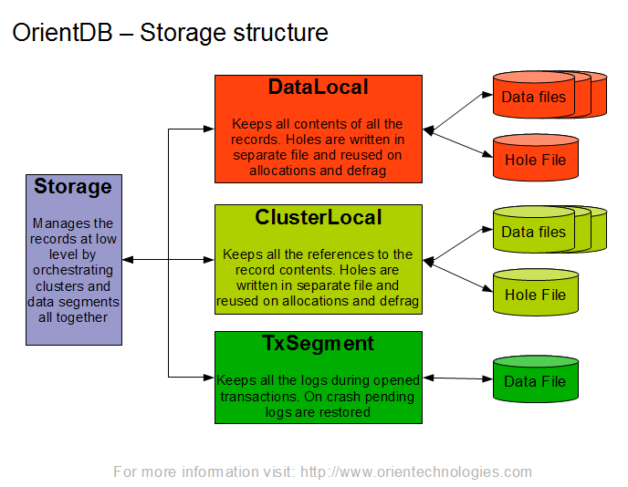

  <h1 align="center">Arangodb multi-model database</h1>
  

    <a href="README.md"><strong>English</strong></a> | <strong>简体中文</strong>
  

## Table of Contents

- [Repository Introduction](#repository-introduction)
- [Prerequisites](#prerequisites)
- [Image Specifications](#image-specifications)
- [Getting Help](#getting-help)
- [How to Contribute](#how-to-contribute)

## Repository Introduction
‌[Arangodb‌](https://github.com/arangodb/arangodb) ArangoDB is a native multi-model open-source database with a flexible data model for documents, graphs, and key-value storage.

**Core Features:**
1. Multi-Model Database Engine: ArangoDB natively supports Document, Graph, and Key-Value data models, allowing them to be mixed within the same database. For instance, user data can be stored in document form (JSON) while social relationships are processed through the graph model, eliminating the need for cross-database migrations or ETL operations.
2. Unified Query Language AQL: Provides a declarative ArangoDB Query Language (AQL) that supports complex queries across models. For example, a single AQL statement can filter documents, traverse graphs (such as shortest path analysis), and perform aggregation calculations, with syntax similar to SQL but extended with graph processing capabilities.
3. Distributed Architecture: Supports horizontal scaling, automatic data sharding, and replication, ensuring high availability. The cluster state is coordinated through the Raft consensus protocol, supporting multi-data center deployments. Sharding strategies (hash/range/geographic) can be flexibly configured to optimize query performance.
4. Native Graph Computing: Built-in graph database engine supports efficient graph traversal, shortest path, subgraph matching, and other operations. Integrates the Pregel algorithm framework, enabling distributed execution of graph analysis tasks like PageRank and community detection without external tools.
5. Full-Text Search and Geospatial Indexing: Integrates ArangoSearch (based on Apache Lucene), supporting full-text retrieval, fuzzy matching, and relevance ranking. Also provides GeoJSON indexing to optimize geospatial queries (such as nearby point searches and area coverage analysis).
6. Transaction Support: Supports ACID transactions, including cross-document and cross-collection transaction operations (single or multiple shards). For example, it can atomically update multiple user documents and associated graph relationships, ensuring data consistency.
7. High-Performance Storage Engine: Uses RocksDB as the default underlying storage engine, optimizing write throughput and compression efficiency. Supports memory-mapped files (MMAP) and caching mechanisms, suitable for high-concurrency OLTP and batch processing scenarios.
8. Multi-Language Drivers and Microservice Integration: Provides official drivers for Python, JavaScript, Java, etc., supporting RESTful APIs and gRPC protocols. Includes the Foxx microservice framework, allowing JavaScript business logic to be deployed directly within the database, reducing network latency.
9. Cloud-Native and Kubernetes Support: Offers the ArangoDB Operator to simplify cluster deployment and management on Kubernetes. Supports backup/recovery, elastic scaling, and monitoring integration (Prometheus metrics exposure), suitable for cloud-native architectures.
10. Open Source and Enterprise Editions: The community edition (Apache 2.0 license) includes core features, while the enterprise edition offers advanced features like encrypted storage, LDAP authentication, audit logs, and a graphical cluster management tool (ArangoGraph).

This project offers pre-configured [**`Arangodb-multi-model database`**]()，images with Arangodb and its runtime environment pre-installed, along with deployment templates. Follow the guide to enjoy an "out-of-the-box" experience.

**Architecture Design:**

> **System Requirements:**
> - CPU: 4vCPUs or higher
> - RAM: 16GB or more
> - Disk: At least 50GB

## Prerequisites
[Register a Huawei account and activate Huawei Cloud](https://support.huaweicloud.com/usermanual-account/account_id_001.html)

## Image Specifications

| Image Version          | Description | Notes |
|------------------------| --- | --- |
| [Arangodb3.12.5-2-kunpeng-v1.0](https://github.com/HuaweiCloudDeveloper/arangodb-image/tree/Arangodb3.12.5-2-kunpeng-v1.0?tab=readme-ov-file) | Deployed on Kunpeng servers with Huawei Cloud EulerOS 2.0 64bit |  |

## Getting Help
- Submit an [issue](https://github.com/HuaweiCloudDeveloper/arangodb-image/issues)
- Contact Huawei Cloud Marketplace product support

## How to Contribute
- Fork this repository and submit a merge request.
- Update README.md synchronously based on your open-source mirror information.