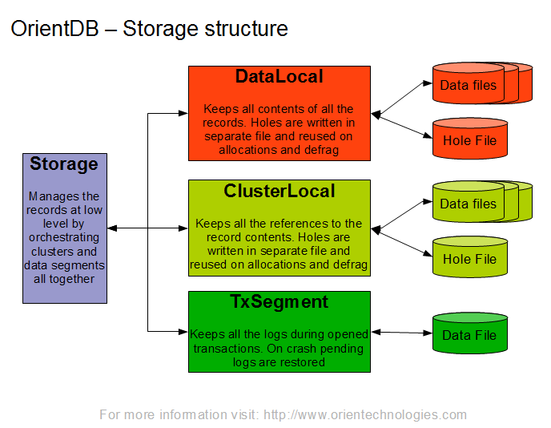

  <h1 align="center">Arangodb 多模型数据库</h1>
  

    <a href="README.md"><strong>English</strong></a> | <strong>简体中文</strong>
  

## 目录

- [仓库简介](#项目介绍)
- [前置条件](#前置条件)
- [镜像说明](#镜像说明)
- [获取帮助](#获取帮助)
- [如何贡献](#如何贡献)

## 项目介绍
‌[Arangodb‌](https://github.com/arangodb/arangodb) ArangoDB 是一个原生多模型开源数据库，具有用于文档、图形和键值的灵活数据模型。

**核心特性：**
1. 多模型数据库引擎：ArangoDB 原生支持文档（Document）、图（Graph）和键值（Key-Value）数据模型，可在同一数据库中混合使用。例如，用户数据可以文档形式存储（JSON），同时通过图模型处理社交关系，无需跨数据库迁移或ETL操作。
2. 统一查询语言AQL：提供声明式的 ArangoDB Query Language (AQL)，支持跨模型的复杂查询。例如，通过单条AQL语句即可实现文档过滤、图遍历（如最短路径分析）和聚合计算，语法类似SQL但扩展了图处理能力。
3. 分布式架构：支持水平扩展，数据自动分片（Sharding）和副本（Replication），具备高可用性。通过Raft共识协议协调集群状态，支持多数据中心部署。可灵活配置分片策略（哈希/范围/地理位置），优化查询性能。
4. 原生图计算：内置图数据库引擎，支持高效的图遍历、最短路径、子图匹配等操作。集成Pregel算法框架，可分布式执行PageRank、社区检测等图分析任务，无需外部工具。
5. 全文本搜索与地理索引：集成ArangoSearch（基于Apache Lucene），支持全文检索、模糊匹配和相关性排序。同时提供GeoJSON索引，优化地理位置查询（如附近点搜索、区域覆盖分析）。
6. 事务支持：支持ACID事务，跨文档、跨集合的事务操作（单分片或多分片）。例如，可原子性更新多个用户的文档及关联的图关系，确保数据一致性。
7. 高性能存储引擎：默认使用RocksDB作为底层存储引擎，优化写入吞吐和压缩效率。支持内存映射文件（MMAP）和缓存机制，适应高并发OLTP和批处理场景。
8. 多语言驱动与微服务集成：提供Python、JavaScript、Java等官方驱动，支持RESTful API和gRPC协议。内置Foxx微服务框架，允许在数据库内直接部署JavaScript业务逻辑，减少网络延迟。
9. 云原生与Kubernetes支持：提供ArangoDB Operator，简化K8s上的集群部署与管理。支持备份/恢复、弹性伸缩和监控集成（Prometheus指标暴露），适合云原生架构。
10. 开源与企业版：社区版（Apache 2.0许可证）包含核心功能，企业版提供加密存储、LDAP认证、审计日志等高级特性，以及图形化集群管理工具（ArangoGraph）。

本项目提供的开源镜像商品 [**`Arangodb-多模型数据库`**]()，已预先安装 Arangodb 软件及其相关运行环境，并提供部署模板。快来参照使用指南，轻松开启“开箱即用”的高效体验吧。

**架构设计：**

> **系统要求如下：**
> - CPU: 4vCPUs 或更高
> - RAM: 16GB 或更大
> - Disk: 至少 50GB

## 前置条件
[注册华为账号并开通华为云](https://support.huaweicloud.com/usermanual-account/account_id_001.html)

## 镜像说明

| 镜像规格                                                                                                                                          | 特性说明 | 备注 |
|-----------------------------------------------------------------------------------------------------------------------------------------------| --- | --- |
| [Arangodb3.12.5-2-kunpeng-v1.0](https://github.com/HuaweiCloudDeveloper/arangodb-image/tree/Arangodb3.12.5-2-kunpeng-v1.0?tab=readme-ov-file) | 基于鲲鹏服务器 + Huawei Cloud EulerOS 2.0 64bit 安装部署 |  |

## 获取帮助
- 更多问题可通过 [issue](https://github.com/HuaweiCloudDeveloper/arangodb-image/issues) 或 华为云云商店指定商品的服务支持 与我们取得联系
- 其他开源镜像可看 [open-source-image-repos](https://github.com/HuaweiCloudDeveloper/open-source-image-repos)

## 如何贡献
- Fork 此存储库并提交合并请求
- 基于您的开源镜像信息同步更新 README.md